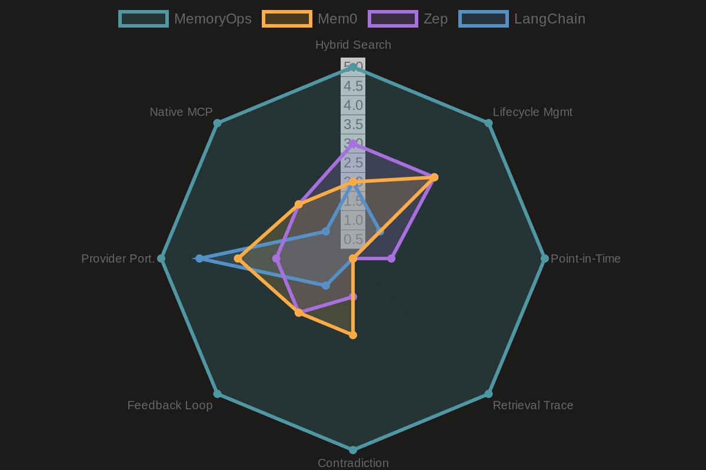
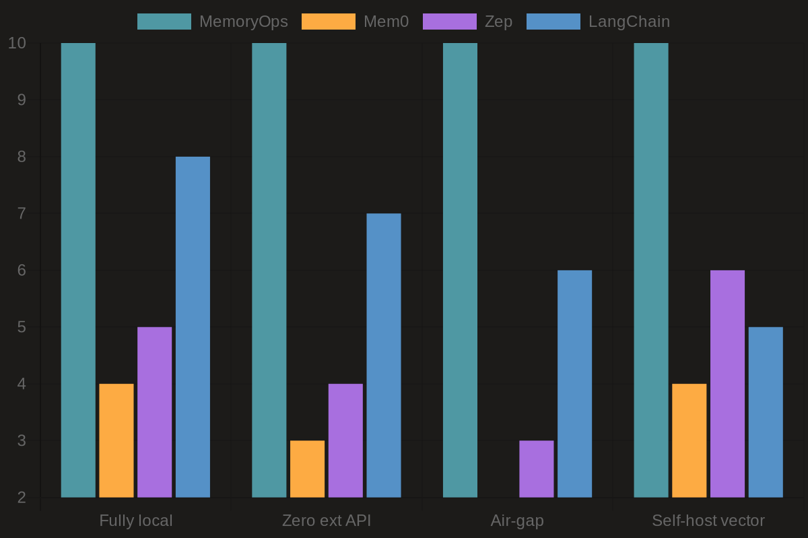

# MemoryOps

[](https://github.com/Quazmoz/memoryops/actions/workflows/ci.yml)
[](https://www.rust-lang.org)
[](LICENSE)
[](#status)
[](CONTRIBUTING.md)

> The Memory Operations Platform for AI Agents

**MemoryOps** is a Rust-powered backend that turns engineering activity (GitHub, Slack, Jira, Linear) into structured, controllable, token-optimized memory for AI agents.

This is **not** a vector database, RAG wrapper, or agent framework.  
This is the **control plane for what AI agents remember**.

---

## The Problem

AI agents today:
- Forget everything across sessions
- Rely on prompt-stuffing hacks
- Use naive top-K retrieval with no context optimization
- Have zero memory governance or lifecycle management

Result: inconsistent agent behavior, repeated instructions, and hallucinations from stale context.

---

## What MemoryOps Does

| Layer | What It Solves |
|-------|----------------|
| **Ingestion** | GitHub, Slack, Jira, Linear — structured activity via HMAC-validated webhooks |
| **Processing** | Event normalization, entity extraction, importance scoring (fast + async LLM paths) |
| **Memory Lifecycle** | Episodic → Semantic promotion, decay, deduplication, automatic pruning |
| **Retrieval Engine** | Token-aware context packing with hybrid semantic + BM25 search |
| **Feedback Loop** | Per-memory ratings bias future retrieval via rolling relevance scores |
| **Point-in-Time Queries** | Reconstruct exact memory state at any past timestamp |
| **Multi-Agent Memory** | Publish semantic memories to workspace pool; sub-agents inherit via config |
| **MCP Server** | Native Model Context Protocol server — agents retrieve, search, and store without HTTP glue |
| **Control UI** | Memory explorer, pin/delete/merge, retrieval trace, audit log, skills registry |

---

## MemoryOps vs. the Field

<p align="center">
  
  
</p>

*See the full interactive breakdown in [docs/assets/comparison-charts.html](docs/assets/comparison-charts.html).*

---

## Architecture

```
┌─────────────────────────────────────────────────────────┐
│                     MemoryOps Platform                  │
│                                                         │
│  ┌──────────────┐   ┌──────────────┐   ┌────────────┐  │
│  │  Ingestion   │──▶│  Processor   │──▶│ Retrieval  │  │
│  │  (Webhooks)  │   │ Fast + Slow  │   │  Engine    │  │
│  └──────────────┘   └──────────────┘   └────────────┘  │
│          │                  │                  │        │
│       Postgres           Redis Queue      Qdrant +      │
│      (events +          (async jobs)     Tantivy        │
│       memories)                         (hybrid)        │
│                                                         │
│  ┌──────────────┐   ┌──────────────────────────────┐   │
│  │  MCP Server  │   │  Memory Control Center (UI)  │   │
│  │  (port 3003) │   │  React 19 + TypeScript       │   │
│  └──────────────┘   └──────────────────────────────┘   │
└─────────────────────────────────────────────────────────┘
```

---

## Prerequisites

- [Rust](https://rustup.rs/) stable — see `rust-toolchain.toml` (currently 1.88.0)
- [Docker](https://www.docker.com/) + Docker Compose
- [Node.js](https://nodejs.org/) 20+ (frontend only)
- [sqlx-cli](https://github.com/sqlx-rs/sqlx/tree/master/sqlx-cli):
  ```bash
  cargo install sqlx-cli --no-default-features --features rustls,postgres
  ```
- [Ollama](https://ollama.com/) for local LLM (default): `ollama pull llama3`

---

## Quick Start

```bash
# 1. Clone
git clone https://github.com/Quazmoz/memoryops.git
cd memoryops

# 2. Start infrastructure (Postgres, Redis, Qdrant)
docker compose up -d

# 3. Configure environment
cp .env.example .env
# Edit .env — set DATABASE_URL, REDIS_URL, QDRANT_URL at minimum

# 4. Run migrations
sqlx migrate run

# 5. Build and start the API
cargo run -p api

# 6. (Optional) Start the frontend
cd frontend && npm install && npm run dev

# 7. (Optional) Seed development data
API_KEY=your-key bash scripts/seed.sh
```

| Service | URL |
|---------|-----|
| API | `http://localhost:8080` |
| Frontend | `http://localhost:5173` |
| MCP Server | `http://localhost:3003` |

```bash
# Verify the API is healthy
curl http://localhost:8080/health/ready
# {"status": "ok"}
```

See [docs/local-development.md](docs/local-development.md) for the full local setup guide including Ollama, port reference, and the test stack.

---

## Connecting AI Clients

MemoryOps exposes MCP tools via HTTP Streamable or stdio transport.

| Client | Guide |
|--------|-------|
| Open WebUI | [docs/integrations/openwebui.md](docs/integrations/openwebui.md) |
| Claude Code | [docs/integrations/claude-code.md](docs/integrations/claude-code.md) |
| GitHub Copilot / VS Code / Continue.dev | [docs/integrations/vscode.md](docs/integrations/vscode.md) |

See [docs/mcp-transport.md](docs/mcp-transport.md) for the full transport reference and HTTP Streamable session lifecycle.

---

## Environment Variables

Copy `.env.example` to `.env`. All required variables must be set before starting.

| Variable | Required | Default | Description |
|----------|----------|---------|-------------|
| `DATABASE_URL` | ✅ | — | Postgres connection string |
| `REDIS_URL` | ✅ | — | Redis connection string |
| `QDRANT_URL` | ✅ | — | Qdrant gRPC URL (`http://localhost:6334`) |
| `APP_HOST` | ❌ | `0.0.0.0` | API bind address |
| `APP_PORT` | ❌ | `8080` | API listen port |
| `APP_ENV` | ❌ | `development` | `development` or `production` |
| `CONFIG_PATH` | ❌ | `config.toml` | Path to TOML config file |
| `OPENAI_API_KEY` | ❌ | — | Required if `embedding.provider = "openai"` |
| `ANTHROPIC_API_KEY` | ❌ | — | Required if `llm.provider = "anthropic"` |
| `OPENROUTER_API_KEY` | ❌ | — | Required if `llm.provider = "openrouter"` |
| `HF_API_KEY` | ❌ | — | Required if `llm.provider = "huggingface"` |
| `GEMINI_API_KEY` | ❌ | — | Required if `llm.provider = "gemini"` |
| `RUST_LOG` | ❌ | `info` | Log level (`trace`/`debug`/`info`/`warn`/`error`) |
| `OTEL_EXPORTER_OTLP_ENDPOINT` | ❌ | — | OTLP endpoint, e.g. `http://localhost:4317` |
| `GITHUB_WEBHOOK_SECRET` | ❌ | `dev-placeholder` | HMAC-SHA256 secret for GitHub webhooks. **Required in production.** |
| `SLACK_SIGNING_SECRET` | ❌ | `dev-placeholder` | Slack signing secret. **Required in production.** |
| `LINEAR_WEBHOOK_SECRET` | ❌ | `dev-placeholder` | Linear webhook secret. **Required in production.** |
| `JIRA_WEBHOOK_SECRET` | ❌ | `dev-placeholder` | Jira webhook secret. **Required in production.** |
| `MCP_TRANSPORT` | ❌ | `stdio` | `http` or `stdio`. Always use `http` in Docker. |
| `MCP_PORT` | ❌ | `3003` | MCP server port (HTTP transport only). |
| `VITE_API_BASE_URL` | ❌ | `/api` | Frontend API proxy base path (frontend only). |
| `VITE_MEMORYOPS_WORKSPACE_ID` | ❌ | — | Workspace UUID for the frontend; set after bootstrap. |

Secrets are **never** stored in `config.toml` — always via environment variables.

See [docs/PROVIDERS.md](docs/PROVIDERS.md) for the full LLM and embedding provider configuration guide.

---

## API Usage Examples

### Create a workspace

```bash
curl -X POST http://localhost:8080/v1/workspaces \
  -H 'Content-Type: application/json' \
  -d '{"name": "acme-engineering"}'
# {"workspace_id": "018f...", "api_key": "mops_018f..._..."}
```

The bootstrap API key is returned **once**. Store it securely.

### Create an additional API key

```bash
curl -X POST http://localhost:8080/v1/workspaces/018f.../keys \
  -H 'X-API-Key: mops_018f...' \
  -H 'Content-Type: application/json' \
  -d '{"name": "coding-agent"}'
# {"key": "mops_acme_3xK9m..."}  ← returned once, store it
```

### Register a GitHub webhook

In your GitHub repo settings, add a webhook pointing to:
```
https://your-host/v1/webhooks/github
```
Set the secret to match `GITHUB_WEBHOOK_SECRET`.

### Retrieve memory for an agent

```bash
curl -X POST http://localhost:8080/v1/retrieve \
  -H 'X-API-Key: mops_acme_3xK9m...' \
  -H 'Content-Type: application/json' \
  -d '{
    "query": "Recent decisions about the auth service?",
    "workspace_id": "018f...",
    "token_budget": 4096,
    "agent_id": "coding-agent"
  }'
```

Response includes scored, token-packed memories and a retrieval trace showing **why** each memory was selected.

### Submit feedback on a retrieved memory

```bash
curl -X POST http://localhost:8080/v1/memory/019a.../feedback \
  -H 'X-API-Key: mops_acme_3xK9m...' \
  -H 'Content-Type: application/json' \
  -d '{
    "query_id": "trace-uuid-from-retrieve",
    "rating": 1,
    "agent_id": "coding-agent",
    "comment": "Exactly the context I needed"
  }'
```

Ratings (`-1`, `0`, `1`) roll into a `relevance_score` that nudges future hybrid retrieval rankings.

### Query memory at a past timestamp

```bash
curl -X POST http://localhost:8080/v1/retrieve \
  -H 'X-API-Key: mops_acme_3xK9m...' \
  -H 'Content-Type: application/json' \
  -d '{
    "query": "auth service decisions",
    "workspace_id": "018f...",
    "as_of": "2026-04-15T00:00:00Z"
  }'
```

---

## Design Decisions

| Decision | Choice | Rationale |
|----------|--------|-----------|
| Embedding model | Pluggable (`EmbeddingProvider` trait) — local default via `fastembed-rs` | No external dependency required; swap to OpenAI via config |
| LLM for summarization | Pluggable (`LlmProvider` trait) — local default via Ollama | Self-hostable by default; OpenAI/Anthropic/OpenRouter/Gemini via config |
| Authentication | API key per workspace (`X-API-Key` header) | Simple, no OAuth complexity in v0.x |
| Retrieval mode | Pull — agent calls `POST /retrieve` | Simpler integration; push/middleware is a future SDK concern |
| Memory scope | Configurable: workspace / agent / user / repo | Operators define scope hierarchy in workspace config |
| Multi-agent sharing | Opt-in publish + workspace pool inheritance | Explicit promotion prevents accidental cross-agent leakage |
| Webhook validation | HMAC-SHA256 for all sources | Consistent, battle-tested |
| MCP transport | stdio + HTTP Streamable | Works with Claude Desktop, VS Code, Open WebUI, Continue.dev |

---

## Tech Stack

| Component | Technology |
|-----------|------------|
| API Server | `axum` |
| Async Runtime | `tokio` |
| Database | PostgreSQL via `sqlx` |
| Vector Search | Qdrant |
| Full-Text Search | Tantivy (BM25) |
| Queue / Cache | Redis Streams |
| Embeddings | `fastembed-rs` (local) / pluggable |
| LLM | Ollama (local) / OpenAI / Anthropic / OpenRouter / Gemini / any OpenAI-compatible |
| MCP Server | `rmcp` — stdio + HTTP Streamable (MCP spec 2025-03-26) |
| Observability | `tracing` + OpenTelemetry |
| Frontend | React 19 + TypeScript + Vite + Tailwind v4 |

---

## Repository Layout

```
memoryops/
├── .github/
│   ├── ISSUE_TEMPLATE/   # Bug report and feature request templates
│   ├── workflows/
│   │   └── ci.yml        # CI pipeline (fmt → clippy → test)
│   ├── pull_request_template.md
│   └── FUNDING.yml
├── crates/
│   ├── api/          # REST API (axum handlers, middleware, routing)
│   ├── common/       # Shared types, DB models, provider traits, config
│   ├── ingestion/    # Webhook receivers (GitHub, Slack, Jira, Linear)
│   ├── mcp/          # MCP server (memory_retrieve, memory_search, memory_store)
│   ├── processor/    # Fast path + async slow-path workers
│   └── retrieval/    # Hybrid search, RRF scoring, token packing, feedback
├── frontend/         # React 19 Memory Control Center
├── migrations/       # sqlx DB migrations
├── scripts/
│   └── seed.sh       # Idempotent dev data seeding
├── docs/
│   ├── integrations/ # MCP client setup guides
│   ├── assets/       # Documentation assets
│   ├── bootstrap.md  # Bootstrap endpoint usage and first-run flow
│   ├── FEATURES.md   # Milestone tracker and full feature list
│   ├── mcp-transport.md  # MCP transport reference and session lifecycle
│   ├── PROVIDERS.md  # LLM and embedding provider configuration
│   ├── SPEC.md       # Full technical specification
│   ├── openapi.yaml  # OpenAPI contract (source of truth)
│   └── local-development.md
├── .env.example
├── docker-compose.yml
├── docker-compose.test.yml
├── rust-toolchain.toml
├── Cargo.toml        # Workspace root
└── README.md
```

---

## Status

MemoryOps is in **alpha**. Core ingestion, processing, retrieval, and MCP transport are functional. The API surface may change before v1.0. Not recommended for production use without review of the security considerations in [SECURITY.md](SECURITY.md).

See [docs/FEATURES.md](docs/FEATURES.md) for the full milestone tracker.

---

## Contributing

Contributions are welcome. Please read [CONTRIBUTING.md](CONTRIBUTING.md) before opening a pull request.

---

## License

[MIT](LICENSE)
