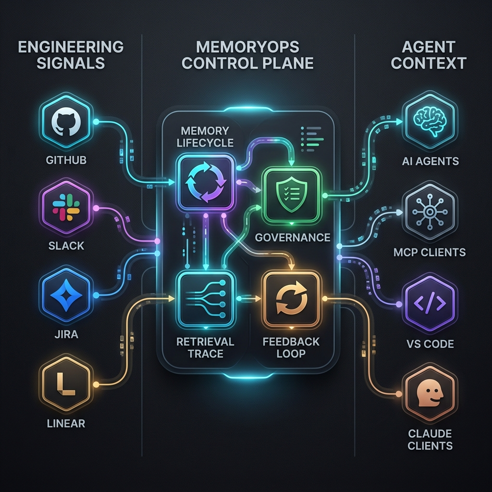
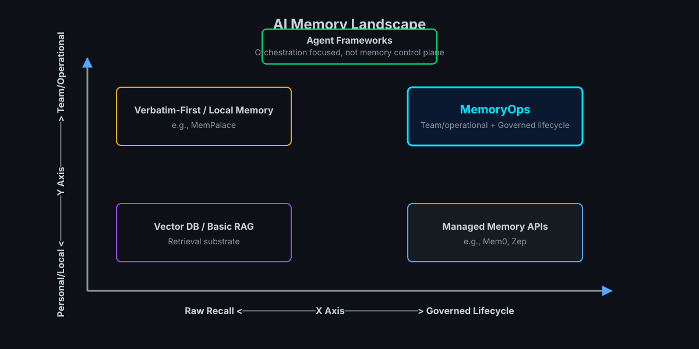
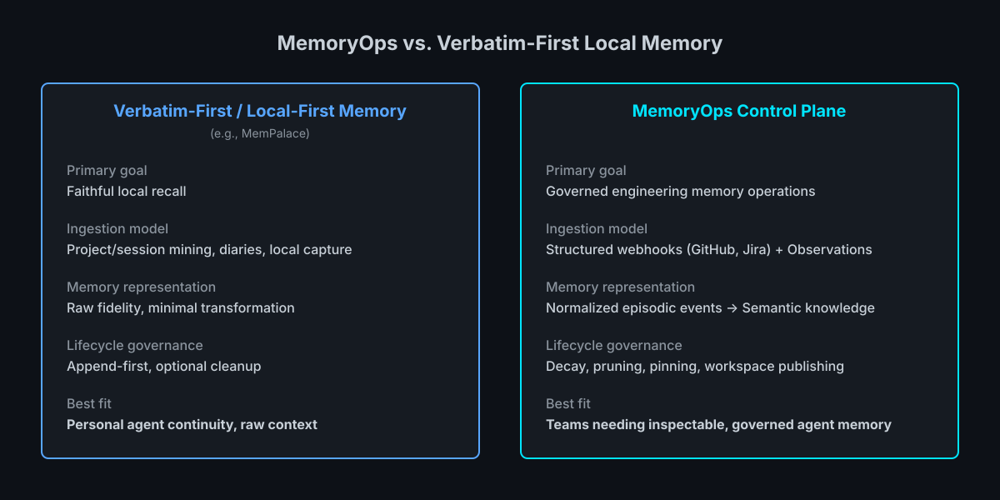
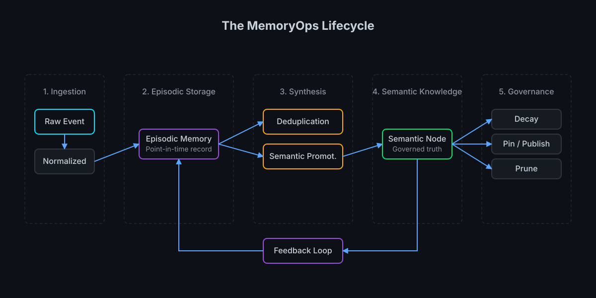
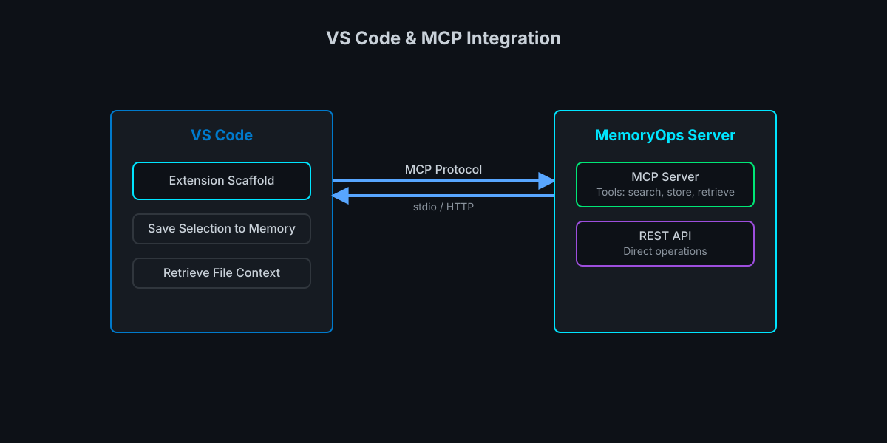
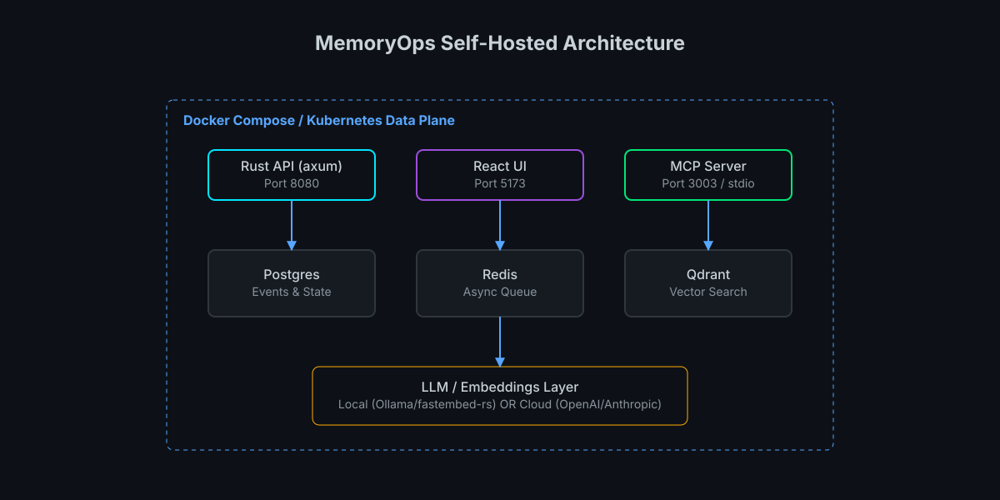

# MemoryOps

[](https://github.com/Quazmoz/memoryops/actions/workflows/ci.yml)
[](https://www.rust-lang.org)
[](LICENSE)
[](#status)
[](CONTRIBUTING.md)

> The Memory Operations Platform for AI Agents

**MemoryOps** is a self-hosted memory control plane for AI agents. It ingests engineering activity from GitHub, Slack, Jira, Linear, and agent observations, turns it into structured governed memory, and retrieves token-optimized context through API, MCP, and a control UI.

This is **not** a vector database, RAG wrapper, or agent framework.  
This is the **control plane for what AI agents remember**.

<p align="center">
  
</p>

**Status:** MemoryOps is alpha. Core ingestion, retrieval, MCP, and control UI are functional, but APIs may change before v1.0.

---

## The Problem

AI agents today:
- Forget everything across sessions
- Rely on prompt-stuffing hacks
- Use naive top-K retrieval with no context optimization
- Have zero memory governance or lifecycle management

Result: inconsistent agent behavior, repeated instructions, and hallucinations from stale context.

---

## Why MemoryOps Exists

Engineering knowledge is distributed across PRs, incidents, tickets, chats, docs, and agent observations. Without a structured memory layer:

- **Agents forget across sessions** — Each conversation starts from zero, requiring repeated context stuffing
- **Prompt stuffing does not scale** — Token budgets are limited; pasting entire repos or chat logs is impractical
- **Naive top-K retrieval fails** — Simple similarity search returns stale or irrelevant context without lifecycle awareness
- **Teams lack governance** — No auditability, feedback loops, or visibility into what agents remember
- **Multi-agent workflows break** — Shared knowledge cannot be published or inherited across agent instances

MemoryOps provides a control plane for memory: structured ingestion, lifecycle governance, retrieval traces, feedback loops, and operator visibility.

---

## Who is this for?

MemoryOps is designed for:

- **AI platform engineers** building coding or DevOps agents that need persistent project context across sessions
- **DevOps/SRE/platform teams** using agents for operational work and requiring memory persistence for runbooks, incidents, and infrastructure decisions
- **Teams building multi-agent workflows** that need shared semantic knowledge pools and workspace-level memory inheritance
- **Self-hosted/local-AI teams** with data-residency requirements who cannot use cloud-hosted memory services
- **Researchers and prototypers** needing memory lifecycle controls, retrieval traces, and feedback loops for agent experimentation

**Probably not for you if:**

- You only need a simple vector database without ingestion or lifecycle management
- You only want a hosted chatbot memory feature and don't need self-hosting
- Your team is not ready to operate self-hosted infrastructure (Postgres, Redis, Qdrant)
- You need verbatim-first local capture with minimal transformation (see comparison below)

---

## What Can You Do With MemoryOps?

- **Give your coding agent project context across sessions** — No more repeating project structure, coding conventions, or architectural decisions
- **Let support agents remember customer history** — Automatically ingest from Slack/Jira and retrieve relevant past interactions
- **Enable incident post-mortems with point-in-time queries** — Reconstruct exactly what the system knew at any past timestamp
- **Share semantic knowledge across multiple agents** — Publish important decisions to a workspace pool that sub-agents inherit
- **Govern memory lifecycle automatically** — Configure decay, promotion, and pruning rules instead of manual cleanup
- **Get retrieval explanations** — See why each memory was selected with per-component scoring traces

---

## What MemoryOps Does

| Layer | Capability | Why it matters |
|-------|------------|----------------|
| **Ingestion** | HMAC-validated webhooks from GitHub, Slack, Jira, Linear + agent observations endpoint | Turns engineering activity into structured events without manual data entry |
| **Processing** | Event normalization, entity extraction, importance scoring (fast + async LLM paths) | Enriches raw events with context and prioritizes what matters |
| **Lifecycle** | Episodic → semantic promotion, decay, deduplication, automatic pruning | Keeps memory relevant and manageable without manual cleanup |


| **Retrieval** | Token-aware context packing with hybrid semantic + BM25 search | Returns optimal context within token budgets, not just top-K results |


| **Feedback** | Per-memory ratings bias future retrieval via rolling relevance scores | System improves from agent and operator feedback over time |
| **Governance** | Retrieval traces, audit log, pin/delete/merge, skills registry | Operators can inspect, control, and understand what agents remember |
| **MCP/API** | Native Model Context Protocol server + REST API | Agents retrieve and store memory without HTTP glue code |
| **Control UI** | Memory explorer, workspace settings, DLQ retry, health dashboard | Operators manage memory without touching the database |


---

## MemoryOps vs. the Field

MemoryOps is designed for governed, inspectable, team-oriented agent memory. It is adjacent to vector databases, RAG wrappers, local-first memory tools, and managed memory APIs, but it focuses on the operational control plane around memory lifecycle and retrieval.

### Where MemoryOps Fits

<p align="center">
  
</p>

### MemoryOps vs. Verbatim-First Local Memory

<p align="center">
  
</p>

Both approaches are valid. MemoryOps is optimized for teams that need governed, inspectable, multi-agent engineering memory. Verbatim-first local memory is attractive when the primary goal is faithful personal/project recall with minimal transformation.

| Dimension | MemoryOps | Verbatim-first / local-first memory systems |
|-----------|-----------|--------------------------------------|
| **Primary goal** | Governed engineering memory operations | Faithful local recall |
| **Ingestion model** | Structured webhooks (GitHub, Jira) + Observations | Project/session mining, diaries, local capture |
| **Memory representation** | Normalized episodic events → Semantic knowledge | Raw fidelity, minimal transformation |
| **Lifecycle governance** | Decay, pruning, pinning, workspace publishing | Append-first, optional cleanup |
| **Retrieval transparency** | Per-component scoring traces, feedback loops | Semantic similarity scores; less granular traceability |
| **Team/agent scope** | Workspace pools, inheritance, multi-agent sharing | Primarily personal/project-scoped |
| **Best fit** | Teams needing inspectable, governed agent memory | Individuals needing faithful local recall with minimal infrastructure |

**Comparison discipline:** MemoryOps avoids benchmark claims unless workloads, baselines, and scoring methods are reproducible. The comparison here focuses on architecture, control surfaces, and operational fit.

### Retrieval Strategy

<p align="center">
  
</p>

### Memory Lifecycle

<p align="center">
  
</p>

---

## What Makes MemoryOps Different?

- **Engineering-tool ingestion** — Native webhooks for GitHub, Slack, Jira, Linear with HMAC validation
- **Agent observations endpoint** — Direct API for agents to submit observations and decisions
- **Memory lifecycle** — Episodic → semantic promotion, decay, deduplication, and automatic pruning
- **Hybrid retrieval** — Semantic + BM25 + token-aware packing with Reciprocal Rank Fusion
- **Feedback loop** — Per-memory ratings bias future retrieval via rolling relevance scores
- **Retrieval traces** — Per-component scoring explains why each memory was selected
- **Control UI** — Memory explorer, pin/delete/merge, audit log, and skills registry
- **MCP server** — Native Model Context Protocol server for Claude Code, VS Code, Open WebUI

<p align="center">
  
</p>
- **Self-hosted stack** — Postgres, Redis, Qdrant with optional/local provider support

<p align="center">
  
</p>
- **Point-in-time queries** — Reconstruct exact memory state at any past timestamp

---

## Architecture

<p align="center">
  
</p>

1. Engineering tools and agents send events or observations.
2. MemoryOps normalizes, scores, and stores events.
3. Lifecycle workers promote, decay, deduplicate, and prune memory.
4. Retrieval combines semantic search, BM25, feedback, and token-aware packing.
5. Agents consume context through REST or MCP.
6. Operators inspect and govern memory through the UI.


---

## Prerequisites

**For the Quick Start (containerized):**
- [Docker](https://www.docker.com/) + Docker Compose
- [sqlx-cli](https://github.com/sqlx-rs/sqlx/tree/master/sqlx-cli) (runs migrations against the Postgres container):
  ```bash
  cargo install sqlx-cli --no-default-features --features rustls,postgres
  ```

**Only needed for local development (non-containerized):**
- [Rust](https://rustup.rs/) stable (1.88.0+)
- [Node.js](https://nodejs.org/) 20+
- [Ollama](https://ollama.com/) (optional, for local LLM): `ollama pull llama3`

---

## Quick Start

Get MemoryOps running with a pre-configured workspace.

```bash
# 1. Clone and configure
git clone https://github.com/Quazmoz/memoryops.git
cd memoryops
cp .env.example .env
# Set these two required secrets in .env:
#   APP_SECRET_KEY=<any-random-string>
#   WORKSPACE_CREATION_SECRET=<any-random-string>

# 2. Start everything
docker compose up -d

# 3. Bootstrap a workspace
WORKSPACE_CREATION_SECRET=<your-secret> node scripts/bootstrap.mjs
# Save the returned workspace_id and api_key securely

# 4. Access the UI
open http://localhost:5173
```

You now have a running MemoryOps instance with:
- API server on `http://localhost:8080`
- Frontend UI on `http://localhost:5173`
- Postgres, Redis, and Qdrant running in containers

**Note:** First-time Docker builds may take several minutes on cold machines. Subsequent starts are instant.

---

## Full Setup (15 minutes)

For custom configuration, webhooks, integrations, and local development.

```bash
# 1. Clone and configure
git clone https://github.com/Quazmoz/memoryops.git
cd memoryops
cp .env.example .env
# Set required secrets and any optional providers

# 2. Start infrastructure
docker compose up -d postgres redis qdrant
docker compose ps  # Verify health checks pass

# 3. Run migrations
# Export DATABASE_URL from .env first:
#   bash/zsh: export $(grep -v '^#' .env | xargs)
#   PowerShell: Get-Content .env | ForEach-Object { if ($_ -match '^([^#][^=]*)=(.*)$') { [System.Environment]::SetEnvironmentVariable($matches[1].Trim(), $matches[2].Trim(), 'Process') } }
sqlx migrate run

# 4. Start API server
docker compose up -d api
# First build takes 2-5 min. Subsequent starts are instant.

# 5. Bootstrap workspace
WORKSPACE_CREATION_SECRET=<your-secret> node scripts/bootstrap.mjs

# 6. Start frontend with workspace ID
MEMORYOPS_WORKSPACE_ID=<workspace_id> docker compose up -d --build frontend

# 7. (Optional) Start MCP server
docker compose up -d mcp

# 8. (Optional) Seed development data
API_KEY=<api_key> node scripts/seed.mjs
```

| Service | URL |
|---------|-----|
| API | `http://localhost:8080` |
| Frontend | `http://localhost:5173` |
| MCP Server | `http://localhost:3003` |

```bash
# Verify the API is healthy
curl http://localhost:8080/health/ready
```

See [docs/local-development.md](docs/local-development.md) for the complete local development guide including Ollama setup, port reference, and the test stack.

Note: You may see a Qdrant client/server version mismatch warning in the API logs (e.g., client 1.17 vs server 1.13). This is harmless for local development and API compatibility is maintained.

---

## Resetting Local Environment

If you experience issues like a stale frontend image (e.g. ERR_EMPTY_RESPONSE on port 5173), you can reset the non-persistent containers:

```bash
docker compose down
docker compose build --no-cache api frontend mcp
docker compose up -d postgres redis qdrant
sqlx migrate run
docker compose up -d api
```

### Full Data Wipe
> **WARNING: Destructive Operation**

```bash
docker compose down -v
```
Using `-v` will delete the Postgres, Redis, and Qdrant volumes. Use this **only** if you want to permanently delete all local workspaces, memories, and start completely fresh.

---

## Troubleshooting

| Issue | Solution |
|-------|----------|
| **Port conflict on 5432** | Run `lsof -i :5432` to see what's using the port. Stop your local Postgres instance, or remap the port in `docker-compose.yml`. |
| **Migrations fail** | Ensure `DATABASE_URL` is exported in your active shell and the Postgres container is healthy (`docker compose ps`). |
| **Slow path jobs stuck in DLQ** | Make sure Ollama is running and the model is pulled (`ollama pull llama3`). Retry jobs from the DLQ UI or via API. |
| **Frontend 404 on `/v1`** | The Vite proxy requires the API server to be running on `8080`. Check that `cargo run -p api` or the API container is successfully running. |
| **Qdrant connection refused** | Ensure the gRPC port `6334` is bound and exposed in `docker-compose.yml` (the Rust client connects via gRPC). |
| **Stale frontend image / ERR_EMPTY_RESPONSE** | The container may be using an old nginx config. Rebuild: `docker compose build --no-cache frontend` and force recreate `docker compose up -d --force-recreate frontend`. |
| **401 Unauthorized** | Check that the `x-api-key` header is present and correct. Regenerate keys from the Settings UI or via `POST /v1/workspaces/{id}/keys`. |
| **Embeddings not updating** | Verify the processor worker is running and Redis is reachable. Check the DLQ for failed jobs. |
| **No search results** | Trigger a re-index from Settings to rebuild the vector index. Ensure memories have been ingested. |
| **MCP not connecting** | Ensure `memoryops-mcp` is on your PATH (or use `cargo run -p mcp`) and the env vars are set correctly. |

For more detailed troubleshooting, see [docs/local-development.md](docs/local-development.md).

---

## Connecting AI Clients

MemoryOps exposes MCP tools via HTTP Streamable or stdio transport.

| Client | Guide |
|--------|-------|
| Open WebUI | [docs/integrations/openwebui.md](docs/integrations/openwebui.md) |
| Claude Code | [docs/integrations/claude-code.md](docs/integrations/claude-code.md) |
| GitHub Copilot / Continue.dev | [docs/integrations/vscode.md](docs/integrations/vscode.md) |
| VS Code Extension | [docs/integrations/vscode-extension.md](docs/integrations/vscode-extension.md) (Early local scaffold, not Marketplace-published) |

See [docs/mcp-transport.md](docs/mcp-transport.md) for the full transport reference and HTTP Streamable session lifecycle.

---

## Environment Variables

Copy `.env.example` to `.env`. All required variables must be set before starting.

### Required Variables

| Variable | Description |
|----------|-------------|
| `DATABASE_URL` | Postgres connection string |
| `REDIS_URL` | Redis connection string |
| `QDRANT_URL` | Qdrant gRPC URL (`http://localhost:6334`) |
| `APP_SECRET_KEY` | Random secret for session/crypto operations |
| `WORKSPACE_CREATION_SECRET` | Bearer secret for `POST /v1/workspaces` (pass as `x-admin-token` header) |

### Optional - Server Configuration

| Variable | Default | Description |
|----------|---------|-------------|
| `APP_HOST` | `0.0.0.0` | API bind address |
| `APP_PORT` | `8080` | API listen port |
| `APP_ENV` | `development` | `development` or `production` |
| `CONFIG_PATH` | `config.toml` | Path to TOML config file |
| `RUST_LOG` | `info` | Log level (`trace`/`debug`/`info`/`warn`/`error`) |
| `OTEL_EXPORTER_OTLP_ENDPOINT` | — | OTLP endpoint, e.g. `http://localhost:4317` |

### Optional - AI Provider Keys

| Variable | When Required |
|----------|---------------|
| `OPENAI_API_KEY` | If `embedding.provider = "openai"` or `llm.provider = "openai"` |
| `ANTHROPIC_API_KEY` | If `llm.provider = "anthropic"` |
| `OPENROUTER_API_KEY` | If `llm.provider = "openrouter"` |
| `HF_API_KEY` | If `llm.provider = "huggingface"` |
| `GEMINI_API_KEY` | If `llm.provider = "gemini"` |

### Optional - Webhook Secrets

| Variable | Default | When Required |
|----------|---------|---------------|
| `GITHUB_WEBHOOK_SECRET` | `dev-placeholder` | **Required in production** for GitHub webhooks |
| `SLACK_SIGNING_SECRET` | `dev-placeholder` | **Required in production** for Slack webhooks |
| `LINEAR_WEBHOOK_SECRET` | `dev-placeholder` | **Required in production** for Linear webhooks |
| `JIRA_WEBHOOK_SECRET` | `dev-placeholder` | **Required in production** for Jira webhooks |

### Optional - MCP Server

| Variable | Default | Description |
|----------|---------|-------------|
| `MCP_TRANSPORT` | `stdio` | `http` or `stdio`. Always use `http` in Docker. |
| `MCP_PORT` | `3003` | MCP server port (HTTP transport only). |

### Optional - Frontend

| Variable | Default | Description |
|----------|---------|-------------|
| `VITE_API_BASE_URL` | `/api` | Frontend API proxy base path (frontend only). |
| `VITE_MEMORYOPS_WORKSPACE_ID` | — | Dev fallback: Workspace UUID for the frontend (build-time). For production, use runtime `MEMORYOPS_WORKSPACE_ID` instead. |
| `MEMORYOPS_WORKSPACE_ID` | — | Runtime workspace UUID for the frontend (loaded from `/config.json`). This is the canonical approach for production deployments. |

Secrets are **never** stored in `config.toml` — always via environment variables.

See [docs/PROVIDERS.md](docs/PROVIDERS.md) for the full LLM and embedding provider configuration guide.

---

## API Usage Examples

### Create a workspace

Workspace creation requires the `x-admin-token` header set to `WORKSPACE_CREATION_SECRET` (see `.env.example`).

```bash
curl -X POST http://localhost:8080/v1/workspaces \
  -H 'Content-Type: application/json' \
  -H 'x-admin-token: <your-WORKSPACE_CREATION_SECRET>' \
  -d '{"name": "acme-engineering"}'
# {"workspace_id": "018f...", "api_key": "mops_018f..._..."}
```

The bootstrap API key is returned **once**. Store it securely.

### Create an additional API key

```bash
curl -X POST http://localhost:8080/v1/workspaces/018f.../keys \
  -H 'X-API-Key: mops_018f...' \
  -H 'Content-Type: application/json' \
  -d '{"name": "coding-agent"}'
# {"key": "mops_acme_3xK9m..."}  ← returned once, store it
```

### Register a GitHub webhook

In your GitHub repo settings, add a webhook pointing to:
```
https://your-host/v1/webhooks/github
```
Set the secret to match `GITHUB_WEBHOOK_SECRET`.

### Retrieve memory for an agent

```bash
curl -X POST http://localhost:8080/v1/retrieve \
  -H 'X-API-Key: mops_acme_3xK9m...' \
  -H 'Content-Type: application/json' \
  -d '{
    "query": "Recent decisions about the auth service?",
    "workspace_id": "018f...",
    "token_budget": 4096,
    "agent_id": "coding-agent"
  }'
```

Response includes scored, token-packed memories and a retrieval trace showing **why** each memory was selected.

### Submit feedback on a retrieved memory

```bash
curl -X POST http://localhost:8080/v1/memory/019a.../feedback \
  -H 'X-API-Key: mops_acme_3xK9m...' \
  -H 'Content-Type: application/json' \
  -d '{
    "query_id": "trace-uuid-from-retrieve",
    "rating": 1,
    "agent_id": "coding-agent",
    "comment": "Exactly the context I needed"
  }'
```

Ratings (`-1`, `0`, `1`) roll into a `relevance_score` that nudges future hybrid retrieval rankings.

### Query memory at a past timestamp

```bash
curl -X POST http://localhost:8080/v1/retrieve \
  -H 'X-API-Key: mops_acme_3xK9m...' \
  -H 'Content-Type: application/json' \
  -d '{
    "query": "auth service decisions",
    "workspace_id": "018f...",
    "as_of": "2026-04-15T00:00:00Z"
  }'
```

---

## Design Decisions

| Decision | Choice | Rationale |
|----------|--------|-----------|
| Embedding model | Pluggable (`EmbeddingProvider` trait) — local default via `fastembed-rs` | No external dependency required; swap to OpenAI via config |
| LLM for summarization | Pluggable (`LlmProvider` trait) — local default via Ollama | Self-hostable by default; OpenAI/Anthropic/OpenRouter/Gemini via config |
| Authentication | API key per workspace (`X-API-Key` header) | Simple, no OAuth complexity in v0.x |
| Retrieval mode | Pull — agent calls `POST /retrieve` | Simpler integration; push/middleware is a future SDK concern |
| Memory scope | Configurable: workspace / agent / user / repo | Operators define scope hierarchy in workspace config |
| Multi-agent sharing | Opt-in publish + workspace pool inheritance | Explicit promotion prevents accidental cross-agent leakage |
| Webhook validation | HMAC-SHA256 for all sources | Consistent, battle-tested |
| MCP transport | stdio + HTTP Streamable | Works with Claude Desktop, VS Code, Open WebUI, Continue.dev |

---

## Tech Stack

| Component | Technology |
|-----------|------------|
| API Server | `axum` |
| Async Runtime | `tokio` |
| Database | PostgreSQL via `sqlx` |
| Vector Search | Qdrant |
| Full-Text Search | Tantivy (BM25) |
| Queue / Cache | Redis Streams |
| Embeddings | `fastembed-rs` (local) / pluggable |
| LLM | Ollama (local) / OpenAI / Anthropic / OpenRouter / Gemini / any OpenAI-compatible |
| MCP Server | `rmcp` — stdio + HTTP Streamable (MCP spec 2025-03-26) |
| Observability | `tracing` + OpenTelemetry |
| Frontend | React 19 + TypeScript + Vite + Tailwind v4 |

---

## Performance Characteristics

| Metric | Typical Value | Notes |
|--------|---------------|-------|
| **Ingestion throughput** | 100-500 events/sec | Depends on webhook source and fast-path concurrency |
| **Retrieval latency (p50)** | 50-150ms | Hybrid search with token packing |
| **Retrieval latency (p95)** | 200-500ms | Includes Qdrant + Postgres + scoring |
| **Memory capacity** | 1M+ memories per workspace | Scales with Postgres and Qdrant storage |
| **Embedding generation** | 10-50ms per memory (local) | Using fastembed-rs; cloud providers vary |
| **Slow-path processing** | 1-5s per memory | LLM summarization via Ollama or cloud provider |

**Scaling recommendations:**
- Single instance handles ~1000 RPM comfortably
- Horizontal scaling supported via stateless API design
- Postgres and Qdrant can be scaled independently
- Redis queue handles backpressure during high ingest periods

---

## Repository Layout

```
memoryops/
├── .github/
│   ├── ISSUE_TEMPLATE/   # Bug report and feature request templates
│   ├── workflows/
│   │   └── ci.yml        # CI pipeline (fmt → clippy → test)
│   ├── pull_request_template.md
│   └── FUNDING.yml
├── crates/
│   ├── api/          # REST API (axum handlers, middleware, routing)
│   ├── common/       # Shared types, DB models, provider traits, config
│   ├── ingestion/    # Webhook receivers (GitHub, Slack, Jira, Linear)
│   ├── mcp/          # MCP server (memory_retrieve, memory_search, memory_store)
│   ├── processor/    # Fast path + async slow-path workers
│   └── retrieval/    # Hybrid search, RRF scoring, token packing, feedback
├── extensions/
│   └── vscode-memoryops/  # Early VS Code extension scaffold
├── frontend/         # React 19 Memory Control Center
├── migrations/       # sqlx DB migrations
├── scripts/
│   ├── bootstrap.mjs  # Workspace bootstrap script
│   ├── seed.mjs       # Development data seeding
│   └── seed.sh        # Shell wrapper for seed.mjs
├── docs/
│   ├── integrations/ # MCP client setup guides
│   ├── assets/       # Documentation assets
│   ├── bootstrap.md  # Bootstrap endpoint usage and first-run flow
│   ├── FEATURES.md   # Milestone tracker and full feature list
│   ├── mcp-transport.md  # MCP transport reference and session lifecycle
│   ├── PROVIDERS.md  # LLM and embedding provider configuration
│   ├── SPEC.md       # Full technical specification
│   ├── openapi.yaml  # OpenAPI contract (source of truth)
│   └── local-development.md
├── .env.example
├── docker-compose.yml        # Local dev (binds ports to 127.0.0.1)
├── docker-compose.prod.yml   # Production overlay (no host-exposed infra ports)
├── docker-compose.test.yml
├── rust-toolchain.toml
├── Cargo.toml        # Workspace root
└── README.md
```

---

## Status

MemoryOps is in **alpha**. Core ingestion, processing, retrieval, and MCP transport are functional. The API surface may change before v1.0. Not recommended for production use without review of the security considerations in [SECURITY.md](SECURITY.md).

---

## Roadmap

See [docs/FEATURES.md](docs/FEATURES.md) for the complete feature roadmap and milestone tracker.

---

## Branch Strategy & CI

| Branch | Purpose | CI |
|--------|---------|-----|
| `main` | Production-ready code | Full CI: fmt, clippy, audit, tests, coverage |
| `development` / `staging` | Active work, staging validation | Lightweight: fmt + frontend build only |
| `feat/**`, `dev/**` | Feature branches | Lightweight: fmt + frontend build only |

Full CI runs only on pushes to `main` and pull requests targeting `main`. The lightweight `dev-lint` workflow runs on all other branches to catch formatting regressions quickly without consuming CI minutes for integration tests.

---

## Getting Help

- **Documentation**: [docs/](docs/) — Complete guides for local development, providers, integrations, and MCP transport
- **Issues**: [GitHub Issues](https://github.com/Quazmoz/memoryops/issues) — Bug reports and feature requests
- **Discussions**: [GitHub Discussions](https://github.com/Quazmoz/memoryops/discussions) — Questions, ideas, and community discussion
- **Security**: [SECURITY.md](SECURITY.md) — Security policy and vulnerability reporting

---

## Contributing

Contributions are welcome. Please read [CONTRIBUTING.md](CONTRIBUTING.md) before opening a pull request.

---

## License

[MIT](LICENSE)
